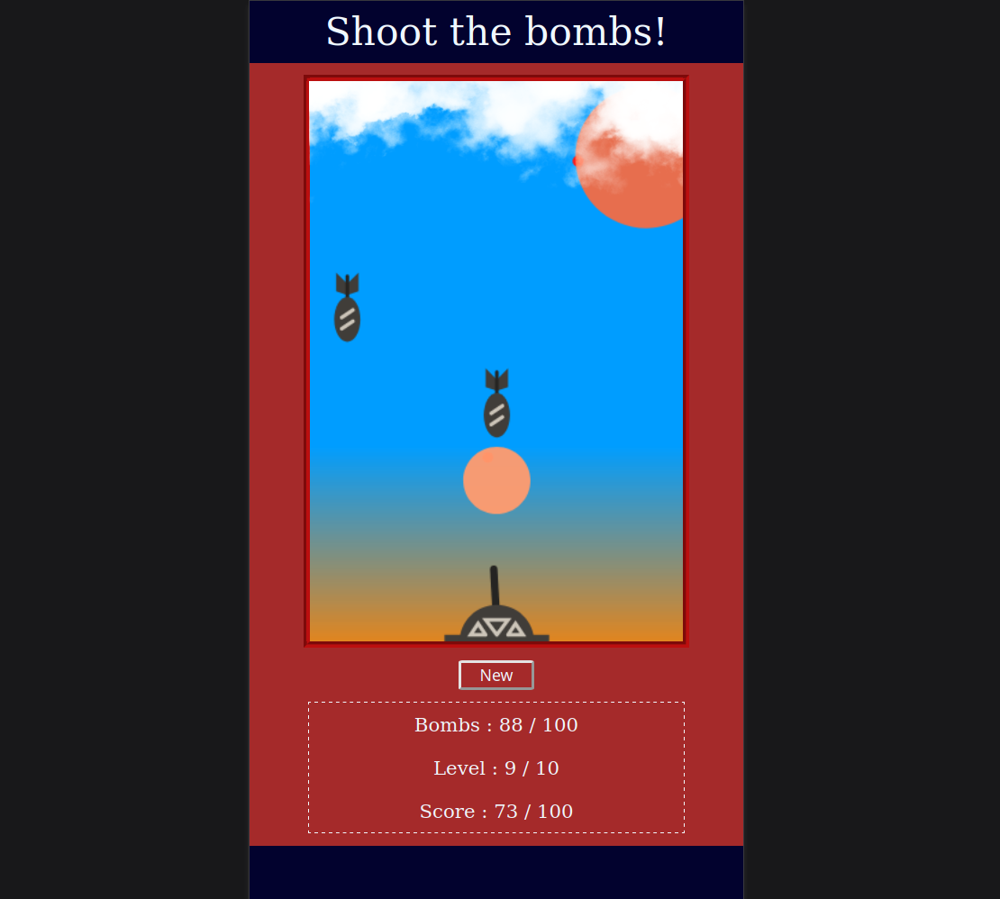

# The Shooting Game

Auteur : <ins>Dyeuse</ins>
 Dernière version : <ins>mai 2022</ins>

**[===> JOUER <===](https://the-shooting-game.netlify.app/)**

## Description

-   Ce projet est un démonstrateur de compétences
-   Développé en Vanilla JS
-   Privilégiant l'emploi de ES6/+
-   Exécuté côté navigateur

Le choix d'un jeu de type "shooting" a été retenu car son développement présente des défis techniques variés.

## Paradigmes utilisés

-   Programmation orientée objet
-   Programmation événementielle

    _+ Règles stylistiques d'Airbnb_

## Principaux outils

-   Babel
-   Npm
-   Git
-   Eslint
-   Prettier
-   Jest
-   Parcel

### _Remarque_

Il était initialement prévu d'utiliser JSDoc notamment afin de bénéficier du "TypeScript check". Mais l'outil n'étant plus mis à jour depuis 2017, cette option n'a pas été retenue.

## Considérations techniques

### _La partie applicative se construit autour de 7 classes :_

1. Zone
    > La classe Zone est la première à être instanciée. Elle établie le périmètre du jeu à partir des dimensions de l'écran de l'utilisateur et d'un conteneur fourni comme argument. Son instance est transmise directement ou indirectement comme argument à tous les autres appel de classe.
2. Radar
    > La classe Radar surveille grâce à des écouteurs d'événements la zone et rend compte de ce qui si passe. Elle détecte les tires de balles, les largages de bombes, les sorties de zone et les éventuelles interceptions. Elle tient à jour le compte des projectiles actifs dans la zone.
3. Sky
    > La classe Sky permet de créer une couverture nuageuse évolutive rendant le jeux plus réaliste. Elle ne dispose que d'une seule méthode publique _(displayClouds)_. Celle-ci doit être appelée avec une liste contenant les chemins vers les différentes images de nuages à afficher.
4. Gun
    > L'instance de la classe Gun est le seul objet pouvant être manipulé directement par l'utilisateur via la souris _(exception faite du redimentionnement)_. C'est aussi le seul endroit où sont créées des instances de la classe Bullet suite à un clic dans la zone.
5. Bullet
    > Une instance de la classe Bullet est créée lorsque le joueur clic dans la zone. La position de la bouche du canon et du curseur en détermine la direction. C'est cette classe qui fournie la méthode _(checkImpact)_ permettant de déterminer une collision entre une bombe et une balle.
6. Bomber
    > Cette classe est la seule dont l'instance reste invisible à l'utilisateur. On considère que le bombardier évolue au-dessus de la couche nuageuse. Son existence rend plus cohérente la gestion des phases de bombardement. C'est aussi le seul endroit où sont créées des instances de la classe Bomb.
7. Bomb
    > Cette classe gère principalement le rendu des instances de bombes, mais aussi le rendu de leur explosion. Les bombes sont générées de manière entièrement automatique par l'instance de la classe Bomber _(lors de l'appel de la méthode raid)_.

Les classes ont été construites de sorte à être indépendantes les unes des autres. Deux exceptions sont à noter, les classes Bullet et Bomb qui sont par nature fortement couplées respectivement aux classes Gun et Bomber.

### _Chacune des classes respecte l'ordre de définition suivants :_

1. Champs de classe de propriétés de donnée
2. Méthode constructeur
3. Champs de classe de propriétés de fonction
4. Accesseurs et mutateurs
5. Méthodes d'instance
6. Méthodes statiques

    _+ Les propriétés ou méthodes publiques sont placées avant les privées_
